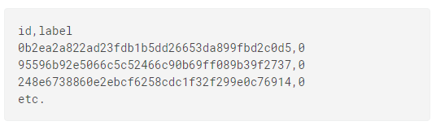
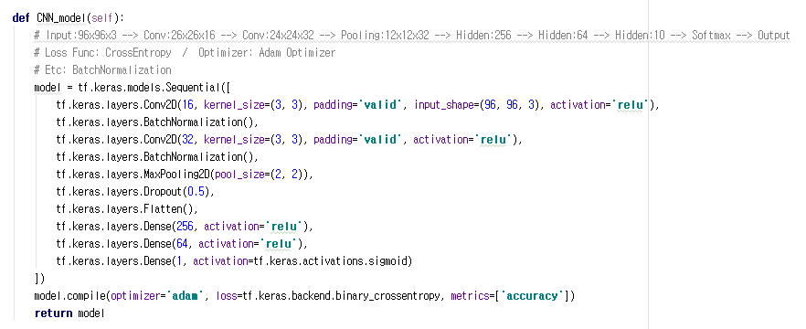
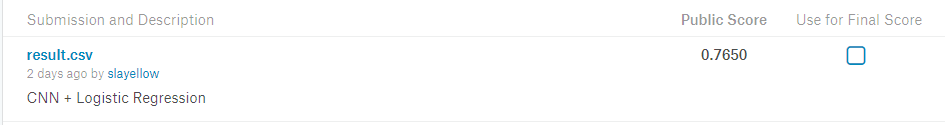

Histopathologic-Cancer-Detection
================================

-	조직병리학 암 탐지 --> 시각적으로 판단

	-	병리학의 한 분야로, 병에 걸린 (식물)조직, 세포변화를 육안적, 현미경적, 조직화학적 또는 전자현미경적 관찰로 건전조직, 세포와 비교하여 이상을 연구함과 동시에 감염, 발병의 기구를 해명하는 학문

-	Site: https://www.kaggle.com/c/histopathologic-cancer-detection

Description
-----------

-	디지털 병리 검사를 통해 가져온 작은 이미지에서 전이암을 확인하는 알고리즘을 개발
-	PatchCamelyeon(PCam) 벤치마크 데이터 셋의 약간 수정된 버전(기존 버전: 중복 이미지 포함 --> 현 버전: 중복 이미지X)
	-	CIFAR-10 및 MNIST와 유사한 직관적인 Binary Image Classification 작업

Goal
----

-	이미지를 Input으로 받으면 알고리즘 모델을 통해 암 탐지 유무를 예측하여 정확도를 평가

Submission File Format
----------------------

Dataset
-------

-	이미지 파일로 구성 / tif 파일 형식
	-	이미지 파일: 96x96x3
-	암이 있는 이미지 파일은 중앙 32x32사이즈에 적어도 하나의 암 세포가 존재
-	Training 과 Test 데이터 셋으로 구분
	-	Training: 220,025개의 이미지 파일과 label이 저장되어 있는 csv파일로 구성
	-	Test: 57,458개의 이미지 파일로 구성

Model
-----

-	2개의 Conv Layer와 3개의 Fully Connected Layer로 구성
-	Conv Layer 사이에 Batch Normalization, Max Pooling 구성
-	Conv Layer 마지막에 Dropout 적용
-	Activation: ReLU
-	Output Func: Sigmoid
-	Loss Func: CrossEntropy
-	Optimizer: Adam

Result
------

### Hyper Parameter

-	Epoch: 30
-	Batch_Size: 1000

Discussion
----------

-	현 모델로는 76.5%의 정확도를 보여줌
-	Conv Layer을 추가하거나, 새로운 Image Classification 모델을 적용하면 더 좋은 성능이 나올 수 있을 것 같다.
